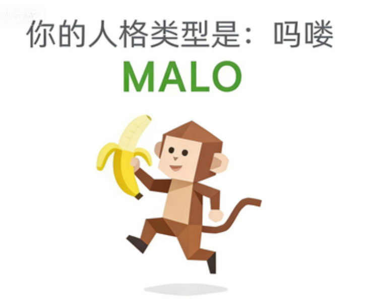

<h1 align="center">SBTI CLI - Test SBTI for your agents.</h1>

<p align="center">
  <em>SBTI CLI - Test SBTI for your agents.</em><br>
  A Node.js CLI with <strong>offline-only execution</strong>, <strong>bundled survey data</strong>, and <strong>result-image export</strong>.
</p>

<p align="center">
  <a href="https://sbti.fancc.de5.net"></a>
  
  
  
  
  
</p>

<p align="center">
  <a href="./README.md"></a>
  <a href="./README.zh-CN.md"></a>
</p>

<p align="center">
  
  
  
  
  
  
</p>

---

## 📖 Table of Contents

- [📖 Table of Contents](#-table-of-contents)
- [🎯 What Is This](#-what-is-this)
- [🧭 Installation \& Setup](#-installation--setup)
- [🧪 Using the CLI](#-using-the-cli)
  - [Common Commands](#common-commands)
  - [Interactive Controls](#interactive-controls)
  - [Typical Run](#typical-run)
- [🧬 Core Capabilities](#-core-capabilities)
- [🎭 Result Images \& Offline Resources](#-result-images--offline-resources)
  - [Export All Result Images](#export-all-result-images)
- [🔬 Data Sources \& How It Works](#-data-sources--how-it-works)
  - [Why It Can Match the Website So Closely](#why-it-can-match-the-website-so-closely)
  - [Where the Poster Art Comes From](#where-the-poster-art-comes-from)
  - [Most Important Files in This Repo](#most-important-files-in-this-repo)
- [🙏 Acknowledgements](#-acknowledgements)
- [📄 License](#-license)

---

## 🎯 What Is This

This repository turns **SBTI** into a local command-line runner.

Key traits:

- 🎲 **Website-equivalent question flow**
- 📊 **Website-equivalent scoring**
- 📴 **Offline-safe execution**
- 🖼️ **Exportable result posters**
- ✅ **Regression coverage**

---

## 🧭 Installation & Setup

Getting started only takes four steps:

| Step | What to do |
|---|---|
| **1️⃣ Install Node.js** | Use **Node.js 18+** so `node` and `npm` are available |
| **2️⃣ Clone the repo** | Download this repository locally |
| **3️⃣ Install dependencies** | Run `npm install` |
| **4️⃣ Verify the setup** | Run `npm test` to confirm the bundled offline runtime works |

```bash
git clone https://github.com/bingran-you/sbti-cli.git
cd sbti-cli
npm install
npm test
```

Published npm tarballs only ship the standalone `dist/sbti-cli.mjs` bundle plus package metadata. Development sources, tests, scripts, and image assets stay in the repository.

After setup, start the CLI with:

```bash
npm run sbti
```

or:

```bash
node src/cli.mjs
```

> 💡 There is no build step, no database, no browser driver, and no `.env` file required. If Node.js is installed, you can run the project.

---

## 🧪 Using the CLI

### Common Commands

| Command | Purpose |
|---|---|
| `npm run sbti` | Start a normal interactive run |
| `npm run sbti -- --seed 42` | Use a deterministic shuffle seed |
| `npm run sbti -- --json` | Print the final result as JSON |
| `npm run export-images` | Rebuild the local poster manifest and gallery from bundled assets |

### Interactive Controls

Once the CLI starts, you answer one question at a time:
Each answer is locked in for that run as soon as you submit it.

| Input | Action |
|---|---|
| `A / B / C / D` | Select the current option |
| `q` | Quit without submitting |

### Typical Run

```bash
npm run sbti
```

```text
SBTI CLI

Question 1 / 31 · dimension hidden
...

Enter A/B/C/D, or q to quit.
> C
```

---

## 🧬 Core Capabilities

<table>
<tr>
  <th>Area</th>
  <th>Capability</th>
  <th>Details</th>
</tr>
<tr>
  <td><strong>🛟 Offline runtime</strong></td>
  <td>Always runs from the bundled snapshot</td>
  <td>The CLI never fetches the live website at runtime, so every questionnaire run stays fully local</td>
</tr>
<tr>
  <td><strong>🖼️ Result-image export</strong></td>
  <td>27 bundled posters can be indexed locally</td>
  <td>The repo can rebuild a JSON manifest and an HTML gallery from the checked-in image files</td>
</tr>
<tr>
  <td><strong>🧪 Regression tests</strong></td>
  <td>Bundled-runtime verification</td>
  <td>Includes runtime parity, 50 deterministic result cases, and offline asset coverage</td>
</tr>
<tr>
  <td><strong>🧰 Scriptable runtime API</strong></td>
  <td>Importable utilities for tooling</td>
  <td>You can reuse <code>loadSbtiRuntime()</code>, <code>buildResultSummary()</code>, and image helpers in custom scripts</td>
</tr>
</table>

---

## 🎭 Result Images & Offline Resources

<table>
  <tr>
    <td align="center" width="33%">
      <a href="assets/type-images/index.html"><br><strong>Local result gallery</strong></a><br>
      <sub>An HTML gallery generated from the extracted poster files</sub>
    </td>
    <td align="center" width="33%">
      <a href="assets/type-images/manifest.json"><br><strong>Image manifest</strong></a><br>
      <sub>File names, MIME types, and sizes for all exported posters</sub>
    </td>
    <td align="center" width="33%">
      <a href="src/bundled-data.mjs"><br><strong>Offline snapshot</strong></a><br>
      <sub>The built-in survey data used for every CLI run</sub>
    </td>
  </tr>
  <tr>
    <td align="center">
      <a href="scripts/export-type-images.mjs"><br><strong>Image export script</strong></a><br>
      <sub>Rebuilds the local poster manifest and gallery from the checked-in image files</sub>
    </td>
    <td align="center">
      <a href="test/runtime.test.mjs"><br><strong>Parity tests</strong></a><br>
      <sub>Checks that CLI results stay aligned with the bundled scoring logic</sub>
    </td>
  </tr>
</table>

### Export All Result Images

```bash
npm run export-images
```

This generates:

- [`assets/type-images/index.html`](assets/type-images/index.html) — local gallery
- [`assets/type-images/manifest.json`](assets/type-images/manifest.json) — poster manifest
- [`assets/type-images/`](assets/type-images/) — all decoded `.png` / `.jpg` files

## 🔬 Data Sources & How It Works

### Why It Can Match the Website So Closely

This repository stores a bundled snapshot of the survey data and scoring logic in [`src/bundled-data.mjs`](src/bundled-data.mjs). [`src/runtime.mjs`](src/runtime.mjs) turns that snapshot into a sandboxed runtime so the CLI can stay local while preserving the original question flow and result math.

The CLI therefore uses the same runtime objects throughout every run:

| Runtime object | Content |
|---|---|
| `dimensionMeta` | Chinese labels and model groups for the 15 dimensions |
| `questions` | The 30 regular questions |
| `specialQuestions` | The drink-gate question set |
| `TYPE_LIBRARY` | Codes, names, intros, and full descriptions for all 27 result types |
| `NORMAL_TYPES` | The 25 normal H / M / L templates |
| `DIM_EXPLANATIONS` | Dimension explanations for each L / M / H tier |
| `computeResult()` | The website's own result-selection branch logic |

That is why the CLI can stay aligned with:

- question shuffle
- drink-gate insertion and hidden question reveal
- 15-dimension scoring and bucketing
- normal-type ranking
- `DRUNK` override
- `HHHH` low-similarity fallback

### Where the Poster Art Comes From

All 27 result posters are checked into [`assets/type-images/`](assets/type-images/). [`scripts/export-type-images.mjs`](scripts/export-type-images.mjs) rebuilds the manifest and gallery pages from those local files.

### Most Important Files in This Repo

- [`src/cli.mjs`](src/cli.mjs) — CLI entry point and interactive questionnaire flow
- [`src/runtime.mjs`](src/runtime.mjs) — bundled runtime loading, sandbox evaluation, and result summarization
- [`src/bundled-data.mjs`](src/bundled-data.mjs) — bundled offline snapshot
- [`src/type-images.mjs`](src/type-images.mjs) — image helpers and local gallery generation
- [`dist/sbti-cli.mjs`](dist/sbti-cli.mjs) — standalone bundled CLI shipped in the npm package
- [`scripts/build-dist.mjs`](scripts/build-dist.mjs) — generates the standalone publishable CLI bundle
- [`scripts/export-type-images.mjs`](scripts/export-type-images.mjs) — local poster metadata rebuild
- [`test/runtime.test.mjs`](test/runtime.test.mjs) — bundled runtime parity tests
- [`test/package.test.mjs`](test/package.test.mjs) — publish-tarball surface checks
- [`test/type-images.test.mjs`](test/type-images.test.mjs) — offline asset coverage

---

## 🙏 Acknowledgements

<table>
  <tr>
    <th>Project</th>
    <th>Author</th>
    <th>Contribution</th>
  </tr>
  <tr>
    <td><a href="https://sbti.fancc.de5.net"><strong>SBTI Personality Test</strong></a></td>
    <td>Bilibili <a href="https://space.bilibili.com/417038183">@蛆肉儿串儿</a></td>
    <td>Original survey author and source of the question text, result copy, and character artwork</td>
  </tr>
  <tr>
    <td><a href="https://github.com/serenakeyitan/sbti-wiki"><strong>sbti-wiki</strong></a></td>
    <td><a href="https://github.com/serenakeyitan">@serenakeyitan</a></td>
    <td>The visual README format here was inspired by that project's centered hero, badges, image strip, and information-card layout</td>
  </tr>
  <tr>
    <td><strong>sbti-cli</strong></td>
    <td><a href="https://github.com/bingran-you">Bingran You (@bingran-you)</a></td>
    <td>Built the sandboxed runtime loader, offline snapshot, image exporter, and regression test suite for a practical terminal workflow</td>
  </tr>
</table>

> ⚠️ **For entertainment only**: the upstream site already warns against treating this as diagnosis, hiring criteria, relationship truth, fortune telling, or any serious judgment. This repo is a tooling and reference project, not a psychological assessment.

---

## 📄 License

The original code and documentation in this repository are released under the [MIT License](LICENSE).

Third-party survey prompts, result text, and extracted character artwork originate from the upstream SBTI website and remain subject to their original ownership. See [NOTICE](NOTICE) for attribution and scope.
